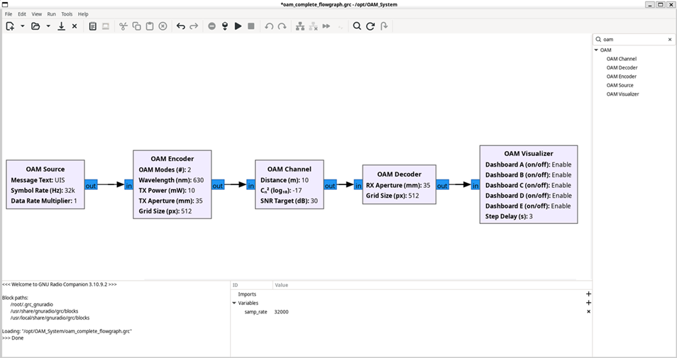
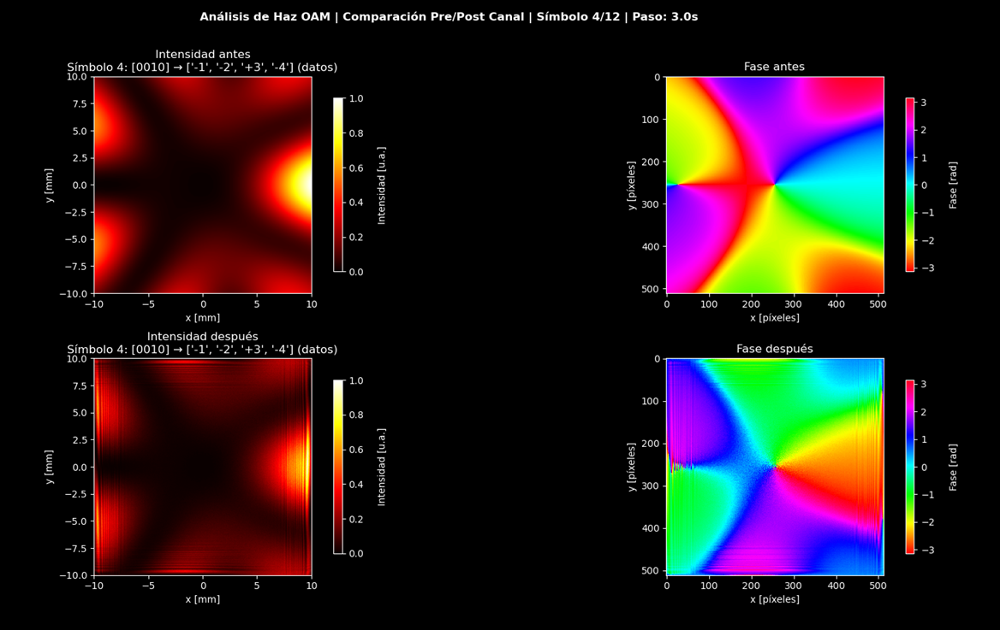

<div align="center">


# OAM Optical Communication System

**Orbital Angular Momentum Encoding and Decoding for GNU Radio**

[](LICENSE)
[](https://www.python.org/)
[](https://www.gnuradio.org/)
[](https://ubuntu.com/)

**A complete optical communication system based on Orbital Angular Momentum (OAM) of light**

[](#-quick-start)
[](#-installation)
[](#-documentation)
[](#-research-applications)

---

</div>

##  Table of Contents

<details open>
<summary><b>Click to expand/collapse</b></summary>

- [ Overview](#-overview)
- [ Features](#-features)
- [ Quick Start](#-quick-start)
- [ Installation](#-installation)
- [ Usage](#-usage)
- [ Mathematical Foundation](#-mathematical-foundation)
- [ System Architecture](#-system-architecture)
- [ GNU Radio Blocks](#-gnu-radio-blocks)
- [ Configuration](#-configuration)
- [ Dashboard System](#-dashboard-system)
- [ Troubleshooting](#-troubleshooting)
- [ Research Applications](#-research-applications)
- [ Authors](#-authors)
- [ License](#-license)
- [ Acknowledgments](#-acknowledgments)

</details>

---

##  Overview

This project implements a **sophisticated optical communication system** that leverages the **orbital angular momentum (OAM)** of light beams to multiplex information across multiple spatial channels. The system provides a comprehensive simulation environment for studying OAM-based free-space optical communications under realistic atmospheric conditions.

<div align="center">



**GNU Radio Implementation - OAM Processing Blocks**

</div>

### System Visualization

<div align="center">



**Intensity and Phase Analysis - Before and After Channel Propagation**

</div>

### Key Highlights

| Feature | Description |
|---------|-------------|
| ** OAM Multiplexing** | 2, 4, 6, or 8 OAM channels for high-capacity transmission |
| ** Atmospheric Effects** | Realistic Kolmogorov turbulence simulation |
| ** Real-time Dashboards** | 5 specialized visualization dashboards (A, B, C, D, E) |
| ** GNU Radio Integration** | Custom blocks for visual flowgraph design |
| ** Pure Python Backend** | Vectorized processing for maximum performance |
| ** Performance Metrics** | SNR, BER, NCC tracking and profiling system |

---

##  Features

<details>
<summary><b> Scientific Features</b></summary>

- **Laguerre-Gaussian Beam Generation** with configurable topological charges (ℓ = ±1, ±2, ±3, ±4)
- **Direct Bit-to-Mode Encoding** for efficient data transmission
- **Kolmogorov Turbulence Model** with split-step phase screen method
- **Normalized Cross-Correlation (NCC) Decoding** for robust symbol detection
- **AWGN Channel Model** with configurable SNR

</details>

<details>
<summary><b> Technical Features</b></summary>

- **Hybrid Architecture**: GNU Radio (frontend) + Python (backend)
- **Centralized Configuration**: Single `oam_system_config.py` file
- **Intelligent Caching**: Configuration-aware cache system
- **Modular Design**: Easily extensible block-based architecture
- **Comprehensive Logging**: Unified logging system across all modules

</details>

<details>
<summary><b> Visualization Features</b></summary>

- **Dashboard A**: Temporal field evolution analysis
- **Dashboard B**: Quality metrics (SNR, BER, NCC)
- **Dashboard C**: Detailed symbol snapshots
- **Dashboard D**: Modal decomposition analysis
- **Dashboard E**: Integrated validation dashboard

</details>

---

##  Quick Start

### Installation (5 minutes)

```bash
# Clone the repository
git clone https://github.com/DeibyArizac/OAM.git
cd OAM

# Install dependencies
sudo apt update
sudo apt install gnuradio python3-gnuradio python3-pip
pip3 install -r requirements.txt

# Install GNU Radio custom blocks
./install.sh
```

### Run Your First Simulation

**Option 1: Python Standalone (Recommended)**
```bash
cd OAM
python3 oam_complete_system.py
```

**Option 2: GNU Radio Companion (Visual)**
```bash
gnuradio-companion oam_complete_flowgraph.grc
# Then click Run (▶) or press F6
```

### Expected Output

```
================================================================================
 OAM SYSTEM EXECUTION COMPLETE
================================================================================

 RESULTS:
   Message transmitted: "UIS"
   Symbols processed: 16
   Message decoded: "UIS" 
   SNR measured: 30.00 dB
   NCC average: 0.42
   Throughput: 0.71 symbols/s

 Data saved in: current_run/
================================================================================
```

---

##  Installation

<details>
<summary><b>System Requirements</b></summary>

### Operating System
- **Ubuntu 22.04 LTS** or later (recommended)
- Other Linux distributions with GNU Radio 3.10+ support

### Core Dependencies
- **GNU Radio 3.10+** - Software-defined radio framework
- **Python 3.8+** - Core programming environment
- **NumPy 1.20.0+** - Numerical computations
- **SciPy 1.7.0+** - Scientific functions (Bessel, special functions)
- **Matplotlib 3.3.0+** - Plotting and visualization
- **PyQt5 5.15.0+** - GUI framework for dashboards

</details>

<details open>
<summary><b>Installation Steps</b></summary>

#### 1. Install GNU Radio

```bash
sudo apt update
sudo apt install gnuradio python3-gnuradio
```

Verify installation:
```bash
gnuradio-companion --version
# Expected: GNU Radio Companion 3.10.x or later
```

#### 2. Install Python Dependencies

```bash
pip3 install -r requirements.txt
```

This installs:
- `numpy` - Array operations and mathematical functions
- `scipy` - Laguerre polynomials and Bessel functions
- `matplotlib` - Plotting and visualization
- `PyQt5` - GUI framework

#### 3. Configure GNU Radio Custom Blocks

```bash
./install.sh
```

Verify installation:
```bash
ls ~/.grc_gnuradio/blocks/oam_*.block.yml
# Expected: 5 files (oam_source, oam_encoder, oam_channel, oam_decoder, oam_visualizer)
```

</details>

---

##  Usage

<details>
<summary><b>Method 1: Python Script (Direct Execution)</b></summary>

```bash
cd /path/to/OAM
python3 oam_complete_system.py
```

This method provides **faster execution** and is recommended for:
- Batch simulations
- Automated testing
- Performance profiling

</details>

<details>
<summary><b>Method 2: GNU Radio Companion (Visual Interface)</b></summary>

1. Launch GNU Radio Companion:
```bash
gnuradio-companion
```

2. Open the example flowgraph:
```
File -> Open -> /path/to/OAM/oam_complete_flowgraph.grc
```

3. Locate the OAM blocks in the block library under category **[OAM]**

4. Configure parameters as needed (see [Configuration](#-configuration) section)

5. Execute the flowgraph:
```
Run -> Execute (F6)
```

</details>

<details>
<summary><b>Method 3: Headless Mode (No GUI)</b></summary>

For automated simulations without visualization:

```bash
python3 oam_complete_system.py --headless
```

Results are automatically saved to `current_run/` directory.

</details>

---

##  Mathematical Foundation

<details>
<summary><b>Laguerre-Gaussian Modes</b></summary>

The system generates Laguerre-Gaussian (LG) beams with helical phase fronts:

```
LG_p^ℓ(r, θ, z) = A · (√2 r / w(z))^|ℓ| · L_p^|ℓ|(2r² / w(z)²) ·
                   exp(-r² / w(z)²) · exp(i ℓ θ) · exp(-i k z)
```

Where:
- **ℓ** = topological charge (orbital angular momentum quantum number)
- **p** = radial mode index (p = 0 for fundamental LG modes)
- **L_p^|ℓ|** = generalized Laguerre polynomial
- **w(z)** = beam waist at position z
- **k** = wave vector = 2π/λ

</details>

<details>
<summary><b>OAM Modulation Scheme</b></summary>

Direct bit-to-mode mapping:
- Binary `0` → negative OAM mode (ℓ < 0)
- Binary `1` → positive OAM mode (ℓ > 0)

For 8 channels [-4, -3, -2, -1, +1, +2, +3, +4]:
- **4 bits per symbol**
- 2 bits encode magnitude: 00→|ℓ|=1, 01→|ℓ|=2, 10→|ℓ|=3, 11→|ℓ|=4
- Each bit position selects sign: 0→negative, 1→positive

**Example:**
- `1011` → magnitude=3 (10), signs=[+,-,+,+] → modes=[+3,-2,+1,-4] (depends on encoding)

</details>

<details>
<summary><b>Atmospheric Turbulence Model</b></summary>

Kolmogorov turbulence with phase screens:

```
Φ_n(f) = 0.033 · Cₙ² · L · exp(-(f·l₀/5.92)²) / (f² + (1/L₀)²)^(11/6)
```

Where:
- **Cₙ²** = refractive index structure constant (turbulence strength)
- **L** = propagation distance
- **L₀** = outer scale of turbulence (typically 20 m)
- **l₀** = inner scale of turbulence (typically 2 mm)
- **f** = spatial frequency

</details>

<details>
<summary><b>Normalized Cross-Correlation (NCC) Detection</b></summary>

Symbol detection using template matching:

```
NCC(ℓ) = |⟨E_rx | LG_ℓ⟩| / (||E_rx|| · ||LG_ℓ||)
```

Where:
- **E_rx** = received optical field
- **LG_ℓ** = reference Laguerre-Gaussian template for mode ℓ
- **⟨·|·⟩** = inner product (spatial integral)
- **||·||** = field norm

**Decision rule:** ℓ̂ = argmax_ℓ NCC(ℓ)

</details>

---

##  System Architecture

<details>
<summary><b>Processing Pipeline</b></summary>

```python
# 1. Source: Generate digital message
message = "UIS"  # ASCII text

# 2. Encoder: Map bits to OAM modes
symbols = [STX, PILOT_ZERO, PILOT_SIGN, ...data..., ETX]
lg_beams = generate_lg_beams(symbols)  # Complex fields

# 3. Channel: Simulate atmospheric propagation
turbulent_beams = apply_turbulence(lg_beams, Cn2=1e-15)
noisy_beams = add_awgn(turbulent_beams, SNR=30)

# 4. Decoder: Detect symbols using NCC
detected_symbols = ncc_detection(noisy_beams)
decoded_message = bytes_from_symbols(detected_symbols)

# 5. Visualizer: Generate dashboards
dashboards = visualize(lg_beams, turbulent_beams, detected_symbols)
```

</details>

<details>
<summary><b>Data Flow</b></summary>

| Stage | Input | Process | Output |
|-------|-------|---------|--------|
| **Source** | ASCII text | STX/ETX framing | Byte stream |
| **Encoder** | Byte stream | Bit→Mode mapping | LG fields |
| **Channel** | LG fields | Turbulence + AWGN | Distorted fields |
| **Decoder** | Distorted fields | NCC correlation | Detected symbols |
| **Visualizer** | All stages | Matplotlib plots | Dashboard figures |

</details>

---

##  GNU Radio Blocks

<details>
<summary><b>OAM Source</b></summary>

Generates digital message data with framing protocol.

**Parameters:**
- `message_text` - Text message to transmit (default: "UIS")
- `symbol_rate` - Symbol transmission rate in Hz (default: 32000)

**Output:** Trigger signal for pipeline execution

</details>

<details>
<summary><b>OAM Encoder</b></summary>

Encodes bit streams into OAM spatial modes.

**Parameters:**
- `num_oam_modes` - Number of OAM channels: 2, 4, 6, or 8 (default: 6)
- `wavelength` - Optical wavelength in meters (default: 1550e-9)
- `tx_power` - Transmitter power in watts (default: 0.01)
- `tx_aperture_size` - Transmitter aperture diameter in meters (default: 0.01)
- `grid_size` - Computational grid resolution (default: 512)

**Modulation Scheme:**
| Modes | Bits/Symbol | Channels |
|-------|-------------|----------|
| 2 | 1 | [-1, +1] |
| 4 | 2 | [-2, -1, +1, +2] |
| 6 | 3 | [-3, -2, -1, +1, +2, +3] |
| 8 | 4 | [-4, -3, -2, -1, +1, +2, +3, +4] |

</details>

<details>
<summary><b>OAM Channel</b></summary>

Simulates atmospheric free-space propagation.

**Parameters:**
- `propagation_distance` - TX-RX distance in meters (default: 50)
- `Cₙ²` - Refractive index structure constant in m⁻²/³ (default: 1e-15)
- `snr_target` - Target signal-to-noise ratio in dB (default: 30)
- `enable_turbulence` - Enable atmospheric turbulence simulation (default: True)
- `enable_noise` - Enable AWGN noise addition (default: True)

**Atmospheric Conditions:**
| Cₙ² | Condition | Description |
|-----|-----------|-------------|
| 10⁻¹⁷ | Laboratory | Very weak turbulence |
| 10⁻¹⁵ | Clear atmosphere | Weak turbulence |
| 10⁻¹⁴ | Moderate turbulence | Daytime conditions |
| 10⁻¹³ | Strong turbulence | High thermal activity |

</details>

<details>
<summary><b>OAM Decoder</b></summary>

Recovers transmitted symbols from received optical fields.

**Parameters:**
- `rx_aperture_size` - Receiver aperture diameter in meters (default: 0.035)
- `detection_method` - Symbol detection algorithm (default: "ncc")
- `correlation_threshold` - Minimum correlation for valid detection (default: 0.5)

**Detection Methods:**
- **ncc** - Normalized Cross-Correlation (robust, recommended)
- **intensity** - Intensity pattern matching (faster, less robust)

</details>

<details>
<summary><b>OAM Visualizer</b></summary>

Launches real-time analysis dashboards.

**Parameters:**
- `enable_dashboard_a` - Temporal field evolution (default: True)
- `enable_dashboard_b` - Quality metrics (SNR, BER, NCC) (default: True)
- `enable_dashboard_c` - Detailed symbol snapshots (default: True)
- `enable_dashboard_d` - Modal decomposition analysis (default: True)
- `enable_dashboard_e` - Integrated validation dashboard (default: True)
- `dashboard_step_delay` - Update interval in seconds (default: 3.0)

</details>

---

##  Configuration

System configuration is centralized in `oam_system_config.py`:

```python
SYSTEM_CONFIG = {
    # System configuration
    'num_oam_modes': 6,              # Number of OAM channels (2, 4, 6, 8)
    'wavelength': 1550e-9,           # Wavelength (m) - 1550nm telecom IR
    'grid_size': 512,                # Computational grid (512x512)
    'message_text': 'UIS',           # Message to transmit
    
    # Transmitter
    'tx_power': 0.01,                # TX power (W) - 10 mW
    'tx_aperture_size': 0.01,        # TX aperture (m) - 10 mm
    'symbol_rate': 32000,            # Symbol rate (Hz) - 32 kHz
    
    # Channel (atmospheric)
    'propagation_distance': 50,      # Distance (m)
    'cn2': 1e-15,                    # Turbulence strength (m⁻²/³)
    'snr_target': 30,                # Target SNR (dB)
    
    # Receiver
    'rx_aperture_size': 0.035,       # RX aperture (m) - 35 mm
    
    # Dashboards
    'enable_dashboard_a': True,      # Enable temporal analysis
    'enable_dashboard_b': True,      # Enable QA metrics
    'enable_dashboard_c': True,      # Enable snapshot view
    'enable_dashboard_d': True,      # Enable modal stream
    'enable_dashboard_e': True,      # Enable validation dashboard
    'dashboard_step_delay': 3.0,     # Dashboard update interval (s)
}
```

### Common Configuration Scenarios

<details>
<summary><b>Laboratory Simulation (Clean Conditions)</b></summary>

```python
'propagation_distance': 10,
'cn2': 1e-17,
'snr_target': 35
```

</details>

<details>
<summary><b>Outdoor Short-Range Link</b></summary>

```python
'propagation_distance': 100,
'cn2': 1e-15,
'snr_target': 25
```

</details>

<details>
<summary><b>Challenging Atmospheric Conditions</b></summary>

```python
'propagation_distance': 500,
'cn2': 1e-14,
'snr_target': 20
```

</details>

---

##  Dashboard System

The visualization system provides 5 specialized dashboards:

| Dashboard | Purpose | Features |
|-----------|---------|----------|
| **A** | Temporal Analysis | Symbol-by-symbol field visualization |
| **B** | Quality Metrics | SNR, BER, NCC tracking |
| **C** | Detailed Snapshot | In-depth modal analysis |
| **D** | Modal Stream | Dynamic modal separation |
| **E** | Integrated Validation | System-level performance |

### Launch Individual Dashboards

```bash
# Dashboard A: Temporal field evolution
python3 oam_visualizer.py --mode simple_dynamic --run current --gui qt

# Dashboard B: QA metrics
python3 oam_visualizer.py --mode qa_dynamic --run current --gui qt --modalmix

# Dashboard C: Detailed snapshot
python3 oam_visualizer.py --mode snapshot_offline --run current --symbol 13 --gui qt

# Dashboard D: Modal stream
python3 oam_visualizer.py --mode modal_stream --run current --gui qt
```

---

##  Troubleshooting

<details>
<summary><b>GNU Radio Companion: Custom blocks do not appear</b></summary>

**Solution:**
```bash
# Verify block installation
ls ~/.grc_gnuradio/blocks/oam_*.block.yml

# Re-run installation script
./install.sh

# Restart GNU Radio Companion completely
pkill -9 gnuradio-companion
gnuradio-companion
```

</details>

<details>
<summary><b>Python Import Error: ModuleNotFoundError</b></summary>

**Solution:**
```bash
# Ensure you're executing from the OAM directory
cd /path/to/OAM
python3 oam_complete_system.py

# Or set PYTHONPATH explicitly
export PYTHONPATH="/path/to/OAM:${PYTHONPATH}"
```

</details>

<details>
<summary><b>Out of Memory (OOM) Error</b></summary>

**Solution:**
Reduce grid size or number of modes in `oam_system_config.py`:
```python
'grid_size': 256,  # Instead of 512
'num_oam_modes': 4,  # Instead of 6 or 8
```

</details>

---

##  Research Applications

This system is designed for research and education in:

- **Free-Space Optical Communications** - OAM multiplexing for high-capacity links
- **Atmospheric Optics** - Turbulence effects on structured light propagation
- **Quantum Communications** - OAM as high-dimensional quantum state space
- **Optical Information Processing** - Spatial mode manipulation and detection
- **Educational Demonstrations** - Visual understanding of OAM physics

### Performance Benchmarks

Typical performance on a modern workstation (Intel i7, 16GB RAM):

| Configuration | Grid Size | Symbols/sec | Memory Usage |
|---------------|-----------|-------------|--------------|
| 2 modes       | 256x256   | ~50         | ~500 MB      |
| 4 modes       | 512x512   | ~20         | ~2 GB        |
| 6 modes       | 512x512   | ~15         | ~3 GB        |
| 8 modes       | 1024x1024 | ~5          | ~8 GB        |

---

##  Authors

<table>
  <tr>
    <td align="center">
      <br />
      <sub><b>Deiby Fernando Ariza Cadena</b></sub><br />
      <sub>Author & Developer</sub><br />
      📧 <a href="mailto:deibyarizac@gmail.com">deibyarizac@gmail.com</a><br />
      🔗 <a href="https://github.com/DeibyArizac">@DeibyArizac</a>
    </td>
    <td align="center">
      <sub><b>Dr. Omar Javier Tíjaro Rojas</b></sub><br />
      <sub>Thesis Director</sub><br />
      📧 <a href="mailto:ojtijaro@uis.edu.co">ojtijaro@uis.edu.co</a><br />
      🏛 Universidad Industrial de Santander
    </td>
  </tr>
</table>

**Institution:**  
School of Electrical, Electronic and Telecommunications Engineering (E³T)  
Universidad Industrial de Santander, Colombia

---

##  License

This project is part of academic research at Universidad Industrial de Santander (UIS).

The code is provided for **educational and research purposes**. For commercial use or redistribution, please contact the authors.

---

##  Acknowledgments

- **Universidad Industrial de Santander** - School of Electrical, Electronic and Telecommunications Engineering (E³T)
- **GNU Radio Project** - Open-source software-defined radio framework
- **Research Community** - Contributors to OAM and free-space optical communications research

---

##  Contact and Support

For questions, suggestions, or collaboration opportunities:

- **Issues:** [GitHub Issue Tracker](https://github.com/DeibyArizac/OAM/issues)
- **Email:** deibyarizac@gmail.com
- **University:** ojtijaro@uis.edu.co

---

<div align="center">

** If this project helps your research, please consider giving it a star!**

**Last Updated:** November 2024 | **Version:** 1.0 (Production7)

</div>
